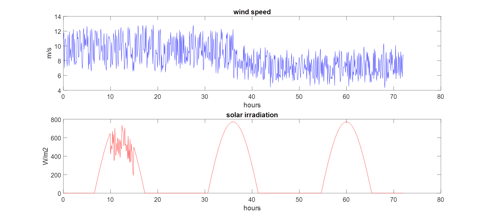
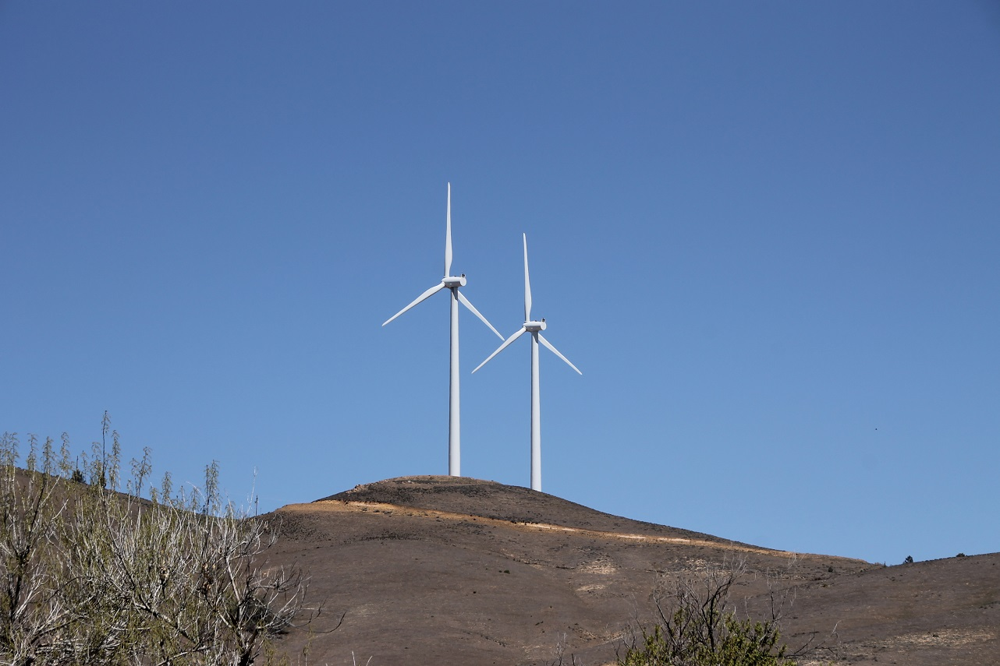

# Datagrunnlag

## Værdata
For en simulert 3 døgns periode med samplingstid på 6 minutter (1/10 time - 720 samples i hver fil).
- Vinddata [hWind.txt](hWind.txt)
- Innstrålingsdata [hIrr.txt](hIrr.txt)
Dataene er som følger hvis de plottes:

## Strømforbruk
- 70 husstander med gjennomsnittlig strømforbruk for en norsk husstand på rundt 200 m2
- 4 gårdsbruk med gjennomsnittlig 100 MWt årlig forbruk hver
- Offentlig strømforbruk (skole, samfunnshus, gatelys, fergekai) har årlig forbruk 500 MWt

OBS! Strømforbruk vil variere i løpet av døgnet og året, men for denne oppgavens del kan du beregne at det er helt jevnt. Om det er for enkelt kan du selvfølgelig gjerne spesifisere en kurve som viser fordelingen både innenfor et døgn og måned.

## Strømproduksjon
### Vindkraft
På øya er det installert 2 vindturbiner:

Med følgende spesifikasjoner:
|                           |                   |
| --------------------------|-------------------|
| Rated power:              | 180.0 kW          |
| Cut-in wind speed:        | 3.0 m/s           |
| Rated wind speed:         | 11.8 m/s          |
| Cut-out wind speed:       | 20.0 m/s          |

Her også kan du anta at det er en jevnt økende kurve fra 0 ved cut-in til maks fra rated til cut-out.

### Solkraft
Det er montert opp 1000 m2 med paneler. Du kan anta at alle yter maks i forhold til dataunderlaget.